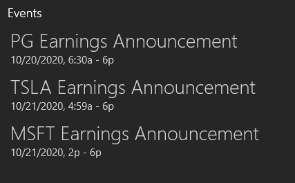

# Earnings-Calendar
This Python script will pull all earnings announcement dates from Yahoo. Our date frame starts with today and goes through the end of the year. With this information, we can build an ics calendar with these events. Below is the example calendar that this python code builds.

## Recommendations and Additional Comments
It takes a long time to pull even 3 months worth of data from yahoo. We recommend running the first part of the code once and placing the data into a CSV that can be referrenced mutliple times during calendar building. We have attached a csv in this repository as an example. 

